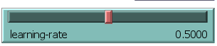
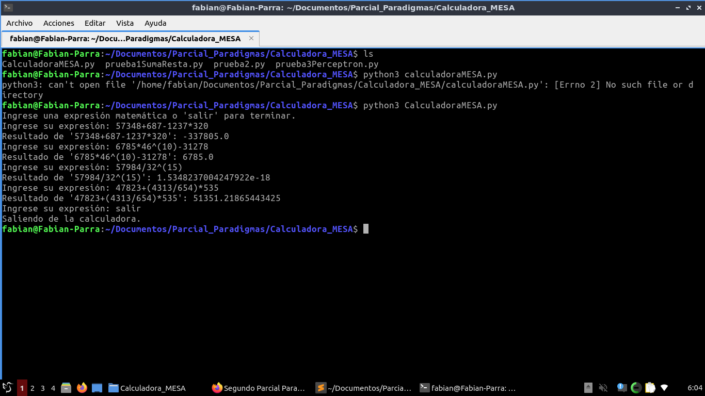
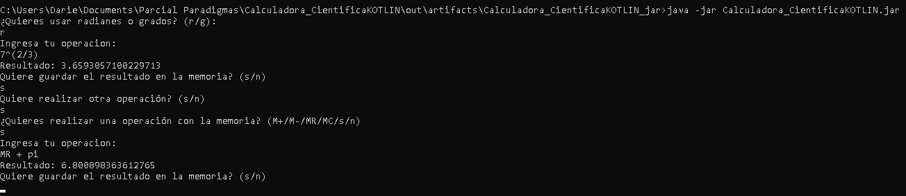
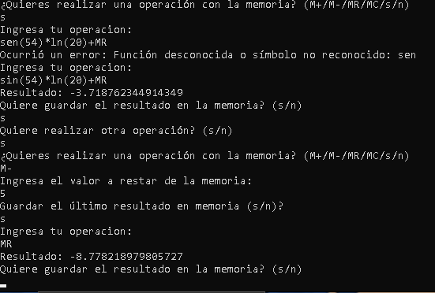
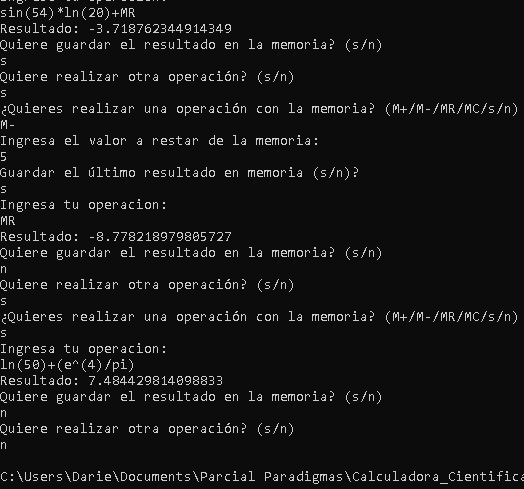

</head><body><article id="13047986-0522-8023-a884-f2e7cb2e2e86" class="page sans"><header><h1 class="page-title"><strong>Segundo Parcial Paradigmas de Programación</strong></h1>

</header>
<nav id="13047986-0522-80cb-935f-e058a59b6629" class="block-color-gray table_of_contents">
<a class="table_of_contents-link" href="#13047986-0522-8022-8d29-c9b7f61d0c7a"><strong>1. Modelamiento de un Perceptrón en NetLogo</strong></a>

<a class="table_of_contents-link" href="#13047986-0522-80a9-88d6-ea3358e72c18">A. <strong>Interfaz gráfica en NetLogo:</strong></a>

<a class="table_of_contents-link" href="#13047986-0522-806c-aedf-fa713fb5ac4f">B. <strong>Modelo del Perceptrón:</strong></a>

<a class="table_of_contents-link" href="#13047986-0522-80b1-a3b5-f02652bf3796">C. <strong>Entrenamiento:</strong></a>

<a class="table_of_contents-link" href="#13047986-0522-80c0-8ebc-f83e342c53ee">D. <strong>Visualización:</strong></a>

<a class="table_of_contents-link" href="#13047986-0522-80f3-a97b-c75a9778bff8">E. <strong>Evaluación:</strong></a>

<a class="table_of_contents-link" href="#13047986-0522-8070-8992-fbd1f90ede04">xor:</a>

<a class="table_of_contents-link" href="#13047986-0522-8014-b97f-f7931d6d2ede">or:</a>

<a class="table_of_contents-link" href="#13047986-0522-80bb-b38b-c04ae7ea986d">and</a>

<a class="table_of_contents-link" href="#13047986-0522-8055-9446-cf8ccffe2d5b">Análisis Final:</a>

<a class="table_of_contents-link" href="#13047986-0522-800a-9e11-f1b649485199"><strong>Resultados Observados para XOR, OR y AND</strong></a>

<a class="table_of_contents-link" href="#13047986-0522-806d-9bda-e576b4352d89">Capturas de pantalla de la simulación mostrando el entrenamiento y la clasificación de los datos.</a>

<a class="table_of_contents-link" href="#13047986-0522-808b-a5d5-d8bff4fcf26c">XOR:</a>

<a class="table_of_contents-link" href="#13047986-0522-8082-baf7-dcc2399a1103">OR:</a>

<a class="table_of_contents-link" href="#13047986-0522-8098-a15c-d7523d6cd079">AND:</a>

<a class="table_of_contents-link" href="#13047986-0522-8091-9d5c-c22ebf075929"><strong>2. Implementación de una Calculadora Basada en el Paradigma de Agentes</strong></a>

<a class="table_of_contents-link" href="#13047986-0522-8038-acab-ccef3191d570">Arquitectura del Sistema</a>

<a class="table_of_contents-link" href="#13047986-0522-80fa-8c5a-f001debdb1fe">Diagrama de Clases</a>

<a class="table_of_contents-link" href="#13047986-0522-80cb-add2-ec472d3581e3">Interacción de Agentes y Mecanismos de Comunicación</a>

<a class="table_of_contents-link" href="#13047986-0522-800d-b092-cef43b328ebd">Algoritmos Usados</a>

<a class="table_of_contents-link" href="#13047986-0522-80fa-a7bf-c5211f193416">Algoritmos Clave</a>

<a class="table_of_contents-link" href="#13047986-0522-80b8-ba5e-d1e10fae3c68">Solución al Problema</a>

<a class="table_of_contents-link" href="#13047986-0522-80a1-be6b-faa3a3213244">Capturas de pantalla del funcionamiento de la calculadora</a>

<a class="table_of_contents-link" href="#13047986-0522-805a-96bb-ffbb10b48ea8">Análisis</a>

<a class="table_of_contents-link" href="#13047986-0522-80be-b0d0-fd4c20d6fd96">Conclusiones</a>

<a class="table_of_contents-link" href="#13047986-0522-805c-83f0-f5b31ad8f62d"><strong>3. Implementación de una Calculadora Científica usando el Paradigma de Objetos en Kotlin</strong></a>

<a class="table_of_contents-link" href="#13047986-0522-8064-bcbf-e9a48a009942">Requisitos del Proyecto</a>

<a class="table_of_contents-link" href="#13047986-0522-80da-b556-e60cea3bd891">A. Clases y Objetos</a>

<a class="table_of_contents-link" href="#13047986-0522-80d3-b598-cd348166b2f7">B. Herencia y Extensión de Funcionalidades</a>

<a class="table_of_contents-link" href="#13047986-0522-80a9-8ff1-d6ba704eae15">C. Polimorfismo</a>

<a class="table_of_contents-link" href="#13047986-0522-80d7-879e-c04d5911a4e7">D. Manejo de Excepciones</a>

<a class="table_of_contents-link" href="#13047986-0522-8089-9b51-c5e170e381fa">E. Funcionalidades Adicionales</a>

<a class="table_of_contents-link" href="#13047986-0522-8071-a9b9-c51bd532358a">Capturas de pantalla del funcionamiento de la calculadora por terminal.</a>

<a class="table_of_contents-link" href="#13047986-0522-8079-8363-da72086d4801">Windows</a>

<a class="table_of_contents-link" href="#13047986-0522-80f7-92d6-de968316da74">Ubuntu (Linux)</a>

<a class="table_of_contents-link" href="#13047986-0522-809a-908f-caf3829cdd46">Experiencia y Reflexión</a>

<a class="table_of_contents-link" href="#13047986-0522-8058-bbda-e0fd9e4bc9df">Cómo Ejecutar el Proyecto</a>
</nav><h1 id="13047986-0522-8022-8d29-c9b7f61d0c7a" class=""><strong>1. Modelamiento de un Perceptrón en NetLogo</strong></h1>
Código:
<link rel="stylesheet" href="https://cdnjs.cloudflare.com/ajax/libs/prism/1.29.0/themes/prism.min.css" integrity="sha512-tN7Ec6zAFaVSG3TpNAKtk4DOHNpSwKHxxrsiw4GHKESGPs5njn/0sMCUMl2svV4wo4BK/rCP7juYz+zx+l6oeQ==" crossorigin="anonymous" referrerPolicy="no-referrer"/><pre id="13047986-0522-80e5-8728-deada535a80a" class="code"><code class="language-VB.Net">globals [
  epoch-error   ;; average error in this epoch
  perceptron    ;; a single output-node
  input-node-1  ;; keep the input nodes in globals so we can refer
  input-node-2  ;; to them directly and distinctly
]

;; A perceptron is modeled by input-node and bias-node agents
;; connected to an output-node agent.

;; Connections from input nodes to output nodes
;; in a perceptron.
links-own [ weight ]

;; all nodes an activation
;; input nodes have a value of 1 or -1
;; bias-nodes are always 1
turtles-own [activation]

breed [ input-nodes input-node ]

;; bias nodes are input-nodes whose activation
;; is always 1.
breed [ bias-nodes bias-node ]

;; output nodes compute the weighted some of their
;; inputs and then set their activation to 1 if
;; the sum is greater than their threshold.  An
;; output node can also be the input-node for another
;; perceptron.
breed [ output-nodes output-node ]
output-nodes-own [threshold]

;;
;; Setup Procedures
;;

to setup
  clear-all

  ;; set our background to something more viewable than black
  ask patches [ set pcolor grey ]

  set-default-shape input-nodes &quot;circle&quot;
  set-default-shape bias-nodes &quot;bias-node&quot;
  set-default-shape output-nodes &quot;output-node&quot;

  create-output-nodes 1 [
    set activation random-activation
    set xcor 6
    set size 2
    set threshold 0
    set perceptron self
  ]

  create-bias-nodes 1 [
    set activation 1
    setxy 3 7
    set size 1.5
    my-create-link-to perceptron

  ]

  create-input-nodes 1 [
    setup-input-node
    setxy -6 5
    set input-node-1 self
  ]

  create-input-nodes 1 [
    setup-input-node
    setxy -6 0
    set input-node-2 self
  ]

  ask perceptron [ compute-activation ]
  reset-ticks
end

to setup-input-node
    set activation random-activation
    set size 1.5
    my-create-link-to perceptron
end

;; links an input or bias node to an output node
to my-create-link-to [ anode ] ;; input or bias node procedure
  create-link-to anode [
    set color red + 1
    ;; links start with a random weight
    set weight random-float 0.1 - 0.05
    set shape &quot;small-arrow-shape&quot;

  ]
end

;;
;; Runtime Procedures
;;

;; train sets the input nodes to a random input
;; it then computes the output
;; it determines the correct answer and back propagates the weight changes
to train ;; observer procedure
  set epoch-error 0
  repeat examples-per-epoch
  [
    ;; set the input nodes randomly
    ask input-nodes
      [ set activation random-activation ]

    ;; distribute error
    ask perceptron [
      compute-activation
      update-weights target-answer
      recolor
    ]
  ]

  ;; plot stats
  set epoch-error epoch-error / examples-per-epoch
  set epoch-error epoch-error * 0.5
  tick
  plot-error
  plot-learned-line
end

;; compute activation by summing the inputs * weights \
;; and run through sign function which determines whether
;; the computed value is above or below the threshold
to compute-activation ;; output-node procedure
  set activation sign sum [ [activation] of end1 * weight ] of my-in-links
  recolor
end

to update-weights [ answer ] ;; output-node procedure
  let output-answer activation

  ;; calculate error for output nodes
  let output-error answer - output-answer

  ;; update the epoch-error
  set epoch-error epoch-error + (answer - sign output-answer) ^ 2

  ;; examine input output edges and set their new weight
  ;; increasing or decreasing it by a value determined by the learning-rate
  ask my-in-links [
    set weight weight + learning-rate * output-error * [activation] of end1
  ]
end

;; computes the sign function given an input value
to-report sign [input]  ;; output-node procedure
  ifelse input &gt; threshold
  [ report 1 ]
  [ report -1 ]
end

to-report random-activation ;; observer procedure
  ifelse random 2 = 0
  [ report 1 ]
  [ report -1 ]
end

to-report target-answer ;; observer procedure
  let a [activation] of input-node-1 = 1
  let b [activation] of input-node-2 = 1
  report ifelse-value run-result (word &quot;my-&quot; target-function &quot; a b&quot;) [1][-1]
end

to-report my-or [a b];; output-node procedure
  report (a or b)
end

to-report my-xor [a b] ;; output-node procedure
  report (a xor b)
end

to-report my-and [a b] ;; output-node procedure
  report (a and b)
end

to-report my-nor [a b] ;; output-node procedure
  report not (a or b)
end

to-report my-nand [a b] ;; output-node procedure
  report not (a and b)
end

;; test runs one instance and computes the output
to test ;; observer procedure
  ask input-node-1 [ set activation input-1 ]
  ask input-node-2 [ set activation input-2 ]

  ;; compute the correct answer
  let correct-answer target-answer

  ;; color the nodes
  ask perceptron [ compute-activation ]

  ;; compute the answer

  let output-answer [activation] of perceptron

  ;; output the result
  ifelse output-answer = correct-answer
  [
    user-message (word &quot;Output: &quot; output-answer &quot;\nTarget: &quot; correct-answer &quot;\nCorrect Answer!&quot;)
  ]
  [
    user-message (word &quot;Output: &quot; output-answer &quot;\nTarget: &quot; correct-answer &quot;\nIncorrect Answer!&quot;)
  ]
end

;; Sets the color of the perceptron&#x27;s nodes appropriately
;; based on activation
to recolor ;; output, input, or bias node procedure
  ifelse activation = 1
    [ set color white ]
    [ set color black ]
  ask in-link-neighbors [ recolor ]

  resize-recolor-links
end

;; resize and recolor the edges
;; resize to indicate weight
;; recolor to indicate positive or negative
to resize-recolor-links
  ask links [
    ifelse show-weights?
    [ set label precision weight 4 ]
    [ set label &quot;&quot; ]
    set thickness 0.2 * abs weight
    ifelse weight &gt; 0
      [ set color [ 255 0 0 196 ] ]   ; transparent red
      [ set color [ 0 0 255 196 ] ] ; transparent light blue
  ]
end

;;
;; Plotting Procedures
;;

;; plot the error from the training
to plot-error ;; observer procedure
  set-current-plot &quot;Error vs. Epochs&quot;
  plotxy ticks epoch-error
end

;; plot the decision line learned
to plot-learned-line ;; observer procedure
  set-current-plot &quot;Rule Learned&quot;
  clear-plot

  run word &quot;plot-&quot; target-function

  ;; cycle through all the x-values and plot the corresponding x-values
  let edge1 [out-link-to perceptron] of input-node-1
  let edge2 [out-link-to perceptron] of input-node-2

  foreach (range -2 3) [ x1 -&gt;
    ;; calculate w0 (the bias weight)
    let w0 sum [[weight] of out-link-to perceptron] of bias-nodes

    ;; put it all together
    let x2 ( (- w0 - [weight] of edge1 * x1) / [weight] of edge2 )

    ;; plot x1, x2
    set-current-plot-pen &quot;rule&quot;
    plotxy x1 x2
  ]
end

to plot-or
  set-current-plot-pen &quot;positives&quot;
  plotxy -1 1
  plotxy 1 1
  plotxy 1 -1
  set-current-plot-pen &quot;negatives&quot;
  plotxy -1 -1
end

to plot-xor
  set-current-plot-pen &quot;positives&quot;
  plotxy -1 1
  plotxy 1 -1
  set-current-plot-pen &quot;negatives&quot;
  plotxy 1 1
  plotxy -1 -1
end

to plot-and
  set-current-plot-pen &quot;positives&quot;
  plotxy 1 1
  set-current-plot-pen &quot;negatives&quot;
  plotxy 1 -1
  plotxy -1 1
  plotxy -1 -1
end

to plot-nor
  set-current-plot-pen &quot;positives&quot;
  plotxy -1 -1
  set-current-plot-pen &quot;negatives&quot;
  plotxy 1 1
  plotxy 1 -1
  plotxy -1 1
end

to plot-nand
  set-current-plot-pen &quot;positives&quot;
  plotxy -1 -1
  plotxy 1 -1
  plotxy -1 1
  set-current-plot-pen &quot;negatives&quot;
  plotxy 1 1
end</code></pre>

<h2 id="13047986-0522-80a9-88d6-ea3358e72c18" class="">A. <strong>Interfaz gráfica en NetLogo:</strong></h2><ul id="13047986-0522-8008-8916-ce1c476d86d8" class="bulleted-list"><li style="list-style-type:disc">Diseña una interfaz con sliders para ajustar los valores de:<ul id="13047986-0522-80da-9401-d8418d880e8a" class="bulleted-list"><li style="list-style-type:circle">Tasa de aprendizaje.</li></ul><figure id="13047986-0522-8007-8ff0-c38e80d5e45e" class="image"></figure><ul id="13047986-0522-80d9-a5c0-ff2515e6cfa5" class="bulleted-list"><li style="list-style-type:circle">Número de iteraciones.</li></ul><figure id="13047986-0522-80aa-a532-c5699207e816" class="image"></figure></li></ul><ul id="13047986-0522-8094-a893-e3c501dacb53" class="bulleted-list"><li style="list-style-type:disc">Botones para:<ul id="13047986-0522-80d1-911b-ceec31dff9d3" class="bulleted-list"><li style="list-style-type:circle">Iniciar la simulación del aprendizaje.</li></ul><ul id="13047986-0522-8035-8d02-e09e10f23ce1" class="bulleted-list"><li style="list-style-type:circle">Restablecer la simulación.</li></ul><figure id="13047986-0522-803e-9be0-c455041b66dd" class="image"></figure></li></ul><h2 id="13047986-0522-806c-aedf-fa713fb5ac4f" class="">B. <strong>Modelo del Perceptrón:</strong></h2><ul id="13047986-0522-8077-bb81-da0b78bb1bf1" class="bulleted-list"><li style="list-style-type:disc">Implementa el algoritmo del perceptrón que pueda clasificar puntos en un plano 2D.</li></ul><ul id="13047986-0522-80f0-be53-d5d672af7c2b" class="bulleted-list"><li style="list-style-type:disc">El perceptrón debe tener dos entradas y un valor de sesgo (bias).</li></ul><ul id="13047986-0522-80c1-8d38-d8a486e91e38" class="bulleted-list"><li style="list-style-type:disc">Los pesos de las entradas deben actualizarse utilizando la regla de actualización basada en la tasa de aprendizaje.</li></ul><ul id="13047986-0522-803d-bd8c-d2e26f724c63" class="bulleted-list"><li style="list-style-type:disc">Inicializa los pesos y el sesgo en valores aleatorios.</li></ul>

<figure id="13047986-0522-809c-b61c-d8374a5ddf0b" class="image"></figure>

<figure id="13047986-0522-8040-8b5e-c72ccae4fcd4" class="image"></figure>

<figure id="13047986-0522-8066-899b-e839eca58b81" class="image"></figure>

<h2 id="13047986-0522-80b1-a3b5-f02652bf3796" class="">C. <strong>Entrenamiento:</strong></h2><ul id="13047986-0522-8071-b628-f357396baf96" class="bulleted-list"><li style="list-style-type:disc">Genera puntos en el plano 2D (turtles en NetLogo) que representen los datos de entrenamiento. Deben ser linealmente separables.</li></ul>
 Los puntos en la grafica Rule Learned dependen de la target-function dependiendo de este ya sea xor, or o and, ya que and y or son funciones linealmente separables. El perceptrón debería ser capaz de encontrar una línea de decisión que divida los puntos correctamente entre las clases. Sin embargo xor no es linealmente separable. Un perceptrón simple no puede resolver esta función porque requiere una división no lineal del espacio de entrada.

Xor: 
<ul id="13047986-0522-80b3-8891-c2d3f37b90ab" class="bulleted-list"><li style="list-style-type:disc">Los puntos (1, 0) y (0, 1) deberían estar en una región clasificada como positiva.</li></ul><ul id="13047986-0522-80df-a818-e9771c2b0fea" class="bulleted-list"><li style="list-style-type:disc">Los puntos (1, 1) y (0, 0) deberían estar en una región clasificada como negativa.</li></ul>
Or:
<ul id="13047986-0522-8066-b6d3-f3c7fee5b5d2" class="bulleted-list"><li style="list-style-type:disc">Los puntos (1, 1), (1, 0), y (0, 1) deberían estar en una región clasificada como positiva.</li></ul><ul id="13047986-0522-8005-89d8-eda3b96c801f" class="bulleted-list"><li style="list-style-type:disc">Solo el punto (0, 0) estará en la región negativa.</li></ul>
And:
<ul id="13047986-0522-803d-bfc2-dc3d5be231bb" class="bulleted-list"><li style="list-style-type:disc">Solo el punto (1, 1) debe estar en una región clasificada como positiva.</li></ul><ul id="13047986-0522-8021-a7ec-cc8d3f5b38d2" class="bulleted-list"><li style="list-style-type:disc">Los otros tres puntos deben estar en la región negativa.</li></ul><ul id="13047986-0522-80e2-ae77-c3eef2db2ccc" class="bulleted-list"><li style="list-style-type:disc">Asigna etiquetas (1 o -1) a los puntos según su posición respecto a una línea de separación (la frontera de decisión).<figure id="13047986-0522-8080-9a7f-ff10fc0d5587" class="image"></figure></li></ul><ul id="13047986-0522-80c9-bc46-db12b4274aaf" class="bulleted-list"><li style="list-style-type:disc">Durante el entrenamiento, ajusta los pesos del perceptrón para aprender a clasificar correctamente los puntos.</li></ul><h2 id="13047986-0522-80c0-8ebc-f83e342c53ee" class="">D. <strong>Visualización:</strong></h2><ul id="13047986-0522-809c-a98c-fccb5d1656ba" class="bulleted-list"><li style="list-style-type:disc">Muestra los puntos y la línea de decisión actualizada en tiempo real durante el entrenamiento.</li></ul><ul id="13047986-0522-8000-8dad-d8d8dcb577d5" class="bulleted-list"><li style="list-style-type:disc">Cambia el color de los puntos correctamente clasificados a verde y los incorrectamente clasificados a rojo.</li></ul>

Xor:
<figure id="13047986-0522-800a-92d3-fbe7c7f6e72e" class="image"></figure>
En xor no puede resolverse y separar lo puntos de la forma correcta ya que este perceptrón es simple y no es capaz de aprender y dar una respuesta.

Or:
<figure id="13047986-0522-802a-a329-dfd2aec614f7" class="image"></figure>

And:
<figure id="13047986-0522-80a2-8dda-f0615fefc46b" class="image"></figure>

<h2 id="13047986-0522-80f3-a97b-c75a9778bff8" class="">E. <strong>Evaluación:</strong></h2><ul id="13047986-0522-8067-bbd0-cdeea12aa604" class="bulleted-list"><li style="list-style-type:disc">Después de que el perceptrón se entrene, verifica su rendimiento clasificando un nuevo conjunto de puntos de prueba.</li></ul><ul id="13047986-0522-80fb-934c-c310eedbec7b" class="bulleted-list"><li style="list-style-type:disc">Muestra el porcentaje de puntos clasificados correctamente.</li></ul>

<h3 id="13047986-0522-8070-8992-fbd1f90ede04" class="">xor:</h3><figure id="13047986-0522-8036-bd74-cf41449378af" class="image"></figure><h3 id="13047986-0522-8014-b97f-f7931d6d2ede" class="">or:</h3><figure id="13047986-0522-801f-9c8f-ddd3f8f366bb" class="image"></figure><h3 id="13047986-0522-80bb-b38b-c04ae7ea986d" class="">and</h3><figure id="13047986-0522-806e-9a34-fedbef03d31d" class="image"></figure><h2 id="13047986-0522-8055-9446-cf8ccffe2d5b" class="">Análisis Final:</h2>
El perceptrón es un modelo básico de una red neuronal artificial, diseñado originalmente para resolver problemas de clasificación binaria. Su objetivo principal es encontrar una línea de decisión (en problemas bidimensionales) que pueda dividir correctamente dos conjuntos de puntos, cada uno perteneciente a una clase distinta (1 o -1, por ejemplo). El perceptrón ajusta los pesos en función de un parámetro llamado <strong>tasa de aprendizaje</strong>, que controla cuánto cambian los pesos en cada actualización. Durante el entrenamiento, el modelo compara su predicción con la salida esperada y ajusta los pesos para reducir el error en el tiempo.

Durante el análisis del perceptrón, una de las observaciones más interesantes fue cómo este modelo funciona bien con funciones linealmente separables, como OR y AND, pero no logra resolver el caso de XOR. Esto realmente destaca la limitación del perceptrón simple cuando se enfrenta a problemas no linealmente separables.

Además, al manipular la tasa de aprendizaje, se nota el impacto en el tiempo de convergencia y la estabilidad del modelo. Cuando la tasa de aprendizaje era demasiado alta, el modelo tendía a oscilar sin encontrar una solución estable; por otro lado, una tasa demasiado baja hacía que el aprendizaje fuera excesivamente lento. Esta experiencia subrayó lo crucial que es encontrar un equilibrio adecuado en este parámetro para que el aprendizaje sea tanto efectivo como eficiente.

La gráfica “Rule Learned” resultó ser especialmente útil. Ver cómo la línea de decisión se movía mientras el perceptrón ajustaba sus pesos permite apreciar visualmente el proceso de aprendizaje del modelo y cómo intentaba encontrar la mejor frontera para clasificar los puntos. 

En resumen, el análisis del perceptrón revela tanto sus capacidades como sus limitaciones en el ámbito del aprendizaje automático. Aunque es eficaz para problemas linealmente separables, su incapacidad para resolver el caso de XOR destaca la necesidad de modelos más avanzados
<h3 id="13047986-0522-800a-9e11-f1b649485199" class=""><strong>Resultados Observados para XOR, OR y AND</strong></h3><ul id="13047986-0522-800c-adc5-d6905f5840b6" class="bulleted-list"><li style="list-style-type:disc"><strong>AND</strong>:<ul id="13047986-0522-80dc-92ce-da4fbb764bf1" class="bulleted-list"><li style="list-style-type:circle">El perceptrón tuvo éxito al aprender esta función. Esto era esperado, ya que AND es linealmente separable; basta con trazar una línea recta para dividir correctamente los puntos. La línea de decisión se estableció de manera que separe la clase (1,1) del resto de las combinaciones (0,0), (1,0), y (0,1), donde sólo la primera cumple la función AND.</li></ul></li></ul><ul id="13047986-0522-8074-8f01-ec06f0a5d292" class="bulleted-list"><li style="list-style-type:disc"><strong>OR</strong>:<ul id="13047986-0522-807f-8e1d-fe0ec5eb01bd" class="bulleted-list"><li style="list-style-type:circle">También fue posible entrenar el perceptrón exitosamente en este caso, ya que OR es otra función linealmente separable. La línea de decisión en OR debía dividir al menos uno de los puntos de clase positiva de los puntos de clase negativa. El perceptrón logra esto sin problemas, ya que puede trazar una línea recta que separe correctamente estas clases.</li></ul></li></ul><ul id="13047986-0522-80ae-bed5-e1acdd9c9134" class="bulleted-list"><li style="list-style-type:disc"><strong>XOR</strong>:<ul id="13047986-0522-809f-8087-d5e8104dfe4b" class="bulleted-list"><li style="list-style-type:circle">Aquí, el modelo falla en aprender la clasificación correcta debido a la naturaleza no lineal de XOR. Los puntos en XOR están dispuestos de manera que se requiere más de una frontera de decisión para separarlos correctamente, lo cual un perceptrón simple no puede hacer. En este caso, aunque el perceptrón intentó ajustar los pesos y sesgos, nunca logró una configuración que separara los puntos correctamente, ya que una sola línea de decisión no es suficiente.</li></ul></li></ul><h2 id="13047986-0522-806d-9bda-e576b4352d89" class="">Capturas de pantalla de la simulación mostrando el entrenamiento y la clasificación de los datos.</h2><h3 id="13047986-0522-808b-a5d5-d8bff4fcf26c" class="">XOR:</h3><figure id="13047986-0522-80b5-8c54-dc1bb01411bc" class="image"></figure><figure id="13047986-0522-803e-b4ed-da7285d18a4f" class="image"></figure><h3 id="13047986-0522-8082-baf7-dcc2399a1103" class="">OR:</h3><figure id="13047986-0522-80b6-a678-d0e5f91e7ff3" class="image"></figure><figure id="13047986-0522-8055-80ae-ecbb5d0c7f90" class="image"></figure><h3 id="13047986-0522-8098-a15c-d7523d6cd079" class="">AND:</h3><figure id="13047986-0522-8072-aa7c-f6288f321da5" class="image"></figure><figure id="13047986-0522-80ea-9741-e6f63422966a" class="image"></figure>
<h1 id="13047986-0522-8091-9d5c-c22ebf075929" class=""><strong>2. Implementación de una Calculadora Basada en el Paradigma de Agentes</strong></h1>
La calculadora implementada es un sistema basado en el paradigma de agentes utilizando la biblioteca MESA de Python. Este sistema permite evaluar expresiones matemáticas utilizando agentes autónomos para manejar diferentes operaciones aritméticas. Este informe describe la arquitectura del sistema, cómo interactúan los agentes, los mecanismos de comunicación utilizados, los algoritmos implementados, la solución al problema planteado, un análisis de la implementación y las conclusiones.
<h2 id="13047986-0522-8038-acab-ccef3191d570" class="">Arquitectura del Sistema</h2>
La arquitectura del sistema se compone de tres componentes principales:
<ol type="1" id="13047986-0522-80db-bf14-e9754429b40c" class="numbered-list" start="1"><li><strong>Agentes de Operación</strong>: Cada agente representa una operación aritmética (suma, resta, multiplicación, división y potencia) y es responsable de ejecutar su operación correspondiente.</li></ol><ol type="1" id="13047986-0522-804e-9cac-f1d0523c47c4" class="numbered-list" start="2"><li><strong>Agente de Entrada/Salida</strong>: Este agente se encarga de la entrada del usuario y de procesar las expresiones matemáticas. Utiliza el método de notación postfija (RPN) para evaluar las expresiones.</li></ol><ol type="1" id="13047986-0522-8089-81d0-d104428d6ac5" class="numbered-list" start="3"><li><strong>Modelo de Calculadora</strong>: Este modelo orquesta la interacción entre los diferentes agentes, gestiona el calendario de los pasos de los agentes y proporciona una interfaz para el usuario.</li></ol><h3 id="13047986-0522-80fa-8c5a-f001debdb1fe" class="">Diagrama de Clases</h3><ul id="13047986-0522-80cc-8941-f98e16705c75" class="bulleted-list"><li style="list-style-type:disc"><strong>OperationAgent</strong>: Clase base para todos los agentes de operación.<ul id="13047986-0522-8082-b99f-e9fa9b931043" class="bulleted-list"><li style="list-style-type:circle"><strong>SumaAgent</strong></li></ul><ul id="13047986-0522-8074-8099-fcccf65bf516" class="bulleted-list"><li style="list-style-type:circle"><strong>RestaAgent</strong></li></ul><ul id="13047986-0522-80cb-9a4b-e4efad9bb0d4" class="bulleted-list"><li style="list-style-type:circle"><strong>MultiplicacionAgent</strong></li></ul><ul id="13047986-0522-8078-80f0-fb44e1037c81" class="bulleted-list"><li style="list-style-type:circle"><strong>DivisionAgent</strong></li></ul><ul id="13047986-0522-8024-b201-c388ddbc541d" class="bulleted-list"><li style="list-style-type:circle"><strong>PotenciaAgent</strong></li></ul></li></ul><ul id="13047986-0522-80ba-84b9-f3e6bebef60a" class="bulleted-list"><li style="list-style-type:disc"><strong>EntradaSalidaAgent</strong>: Clase que maneja la entrada del usuario y la evaluación de expresiones.</li></ul><ul id="13047986-0522-80f2-b77b-d7e39e4facb8" class="bulleted-list"><li style="list-style-type:disc"><strong>CalculatorModel</strong>: Clase que representa el modelo de la calculadora.</li></ul><h2 id="13047986-0522-80cb-add2-ec472d3581e3" class="">Interacción de Agentes y Mecanismos de Comunicación</h2>
Los agentes interactúan mediante el modelo de comunicación de MESA, donde el <strong>CalculatorModel</strong> actúa como un orquestador. Cuando el <strong>EntradaSalidaAgent</strong> recibe una expresión, realiza los siguientes pasos:
<ol type="1" id="13047986-0522-8033-a9d4-c78238492f72" class="numbered-list" start="1"><li><strong>Parseo de la Expresión</strong>: Utiliza el método <code>parse_expression</code> para convertir la expresión en notación postfija.</li></ol><ol type="1" id="13047986-0522-803e-99cb-ca6ef203944e" class="numbered-list" start="2"><li><strong>Evaluación</strong>: El método <code>evaluate_rpn</code> evalúa la expresión utilizando los agentes de operación. Cada vez que se encuentra un operador, se llama al método <code>execute</code> del agente correspondiente.</li></ol>
Los agentes se comunican de manera indirecta a través del modelo, el cual actúa como un intermediario para mantener el estado y la secuencia de ejecución.
<h2 id="13047986-0522-800d-b092-cef43b328ebd" class="">Algoritmos Usados</h2><ol type="1" id="13047986-0522-80ef-9dd6-c160c10e64ea" class="numbered-list" start="1"><li><strong>Parsing de Expresiones</strong>: Se utiliza el algoritmo de Shunting Yard para convertir la expresión de notación infija a notación postfija (RPN).</li></ol><ol type="1" id="13047986-0522-801a-b795-c8f4e13c4dd8" class="numbered-list" start="2"><li><strong>Evaluación de RPN</strong>: Se utiliza una pila para evaluar la expresión postfija, donde los números se apilan y se desapilan al encontrar operadores, invocando a los agentes correspondientes para realizar las operaciones.</li></ol><h3 id="13047986-0522-80fa-a7bf-c5211f193416" class="">Algoritmos Clave</h3><ul id="13047986-0522-80e8-b7ae-c4e24bba0fa2" class="bulleted-list"><li style="list-style-type:disc"><code><strong>parse_expression</strong></code>: Convierte la expresión de entrada a RPN, teniendo en cuenta la precedencia de operadores y la correcta identificación de números negativos.</li></ul><ul id="13047986-0522-80bc-969f-ec33d9aa5e26" class="bulleted-list"><li style="list-style-type:disc"><code><strong>evaluate_rpn</strong></code>: Evalúa la expresión en RPN utilizando una pila y los agentes de operación.</li></ul><h2 id="13047986-0522-80b8-ba5e-d1e10fae3c68" class="">Solución al Problema</h2>
El problema inicial era implementar una calculadora que pudiera evaluar expresiones aritméticas utilizando un enfoque de programación orientada a agentes. La solución se implementó a través de la creación de agentes especializados para cada operación, un agente de entrada/salida para manejar la interacción del usuario, y un modelo que orquesta las operaciones.
<h2 id="13047986-0522-80a1-be6b-faa3a3213244" class="">Capturas de pantalla del funcionamiento de la calculadora</h2><figure id="13047986-0522-80c7-8be0-ee0f429d5a10" class="image"></figure><h2 id="13047986-0522-805a-96bb-ffbb10b48ea8" class="">Análisis</h2>
La implementación de la calculadora permite una fácil expansión y modificación. Por ejemplo, se pueden añadir nuevos agentes para nuevas operaciones sin modificar significativamente el resto del sistema. La separación de responsabilidades entre agentes y el uso de un modelo central simplifican el mantenimiento y la escalabilidad.
<h2 id="13047986-0522-80be-b0d0-fd4c20d6fd96" class="">Conclusiones</h2>
La experiencia de implementar esta calculadora basada en el paradigma de agentes ha proporcionado una comprensión más profunda sobre:
<ol type="1" id="13047986-0522-802b-9fbe-de2d74f1adfc" class="numbered-list" start="1"><li><strong>Programación Orientada a Agentes</strong>: Aprender cómo los agentes pueden colaborar para resolver problemas complejos.</li></ol><ol type="1" id="13047986-0522-802f-8aca-ebbfae37d163" class="numbered-list" start="2"><li><strong>Arquitectura Modular</strong>: La importancia de diseñar sistemas modulares y escalables.</li></ol><ol type="1" id="13047986-0522-809f-92c3-fe4b365a18a8" class="numbered-list" start="3"><li><strong>Manejo de Errores</strong>: La necesidad de implementar una robusta gestión de errores al evaluar expresiones matemáticas.</li></ol>
El enfoque basado en agentes no solo es efectivo para este problema, sino que también puede aplicarse a otras áreas donde se requiera el procesamiento de tareas independientes y la colaboración entre componentes.

<h1 id="13047986-0522-805c-83f0-f5b31ad8f62d" class=""><strong>3. Implementación de una Calculadora Científica usando el Paradigma de Objetos en Kotlin</strong></h1>
Este proyecto implementa una calculadora científica en Kotlin que cumple con varios requisitos de programación orientada a objetos, como el uso de clases, herencia, polimorfismo y manejo de excepciones. La calculadora permite realizar operaciones aritméticas básicas y avanzadas, incluyendo operaciones científicas como trigonometría, logaritmos, potencias, funciones exponenciales y manejo de memoria. La entrada de expresiones complejas es soportada mediante el uso del algoritmo de Shunting Yard, y el proyecto está diseñado para ejecutarse en la terminal.
<h3 id="13047986-0522-8064-bcbf-e9a48a009942" class="">Requisitos del Proyecto</h3><h3 id="13047986-0522-80da-b556-e60cea3bd891" class="">A. Clases y Objetos</h3>
La clase base <code>Calculadora</code> contiene las operaciones aritméticas básicas, organizadas y encapsuladas de forma que faciliten su uso:
<ul id="13047986-0522-802d-8295-c1e7a2721338" class="bulleted-list"><li style="list-style-type:disc"><strong>Operaciones Básicas</strong>: La clase <code>Calculadora</code> tiene métodos para suma, resta, multiplicación y división, y cada uno maneja posibles excepciones, como la división por cero. Estas operaciones se aplican de manera segura para evitar errores inesperados en tiempo de ejecución.</li></ul><link rel="stylesheet" href="https://cdnjs.cloudflare.com/ajax/libs/prism/1.29.0/themes/prism.min.css" integrity="sha512-tN7Ec6zAFaVSG3TpNAKtk4DOHNpSwKHxxrsiw4GHKESGPs5njn/0sMCUMl2svV4wo4BK/rCP7juYz+zx+l6oeQ==" crossorigin="anonymous" referrerPolicy="no-referrer"/><pre id="13047986-0522-803c-b631-e4f0f294a08b" class="code"><code class="language-Kotlin" style="white-space:pre-wrap;word-break:break-all">class Calculadora {
    fun sumar(a: Double, b: Double) = a + b
    fun restar(a: Double, b: Double) = a - b
    fun multiplicar(a: Double, b: Double) = a * b
    fun dividir(a: Double, b: Double): Double {
        if (b == 0.0) throw IllegalArgumentException(&quot;No se puede dividir entre cero&quot;)
        return a / b
    }
}
</code></pre><h3 id="13047986-0522-80d3-b598-cd348166b2f7" class="">B. Herencia y Extensión de Funcionalidades</h3>
Para extender las capacidades de <code>Calculadora</code>, se crea una clase derivada llamada <code>CalculadoraCientifica</code> que hereda los métodos básicos y añade funcionalidades científicas avanzadas:
<ul id="13047986-0522-8041-9df2-d94d7f1deb15" class="bulleted-list"><li style="list-style-type:disc"><strong>Funciones Trigonométricas</strong>: La clase <code>CalculadoraCientifica</code> incluye métodos para seno, coseno y tangente. Estas funciones permiten trabajar en grados o radianes, proporcionando flexibilidad para cálculos que dependen de la unidad de ángulo.</li></ul><ul id="13047986-0522-8047-9a8d-d701d18334b7" class="bulleted-list"><li style="list-style-type:disc"><strong>Potencias y Raíces</strong>: La clase permite realizar potencias y extraer raíces cuadradas, gestionando también posibles entradas no válidas, como intentar calcular la raíz de un número negativo.</li></ul><ul id="13047986-0522-804c-aab0-c120b0a74be0" class="bulleted-list"><li style="list-style-type:disc"><strong>Logaritmos y Exponenciales</strong>: Incluye funciones para logaritmos en base 10, logaritmos naturales (base <code>e</code>) y exponentes, utilizando métodos de la biblioteca matemática de Kotlin.</li></ul><ul id="13047986-0522-80a2-8d86-e15e7a34b685" class="bulleted-list"><li style="list-style-type:disc"><strong>Conversión de Ángulos</strong>: Permite convertir entre grados y radianes para facilitar el uso de las funciones trigonométricas.</li></ul><link rel="stylesheet" href="https://cdnjs.cloudflare.com/ajax/libs/prism/1.29.0/themes/prism.min.css" integrity="sha512-tN7Ec6zAFaVSG3TpNAKtk4DOHNpSwKHxxrsiw4GHKESGPs5njn/0sMCUMl2svV4wo4BK/rCP7juYz+zx+l6oeQ==" crossorigin="anonymous" referrerPolicy="no-referrer"/><pre id="13047986-0522-8083-85aa-eb3aeb12be71" class="code"><code class="language-Kotlin" style="white-space:pre-wrap;word-break:break-all">class CalculadoraCientifica : Calculadora() {
    fun seno(grados: Double): Double = Math.sin(Math.toRadians(grados))
    fun coseno(grados: Double): Double = Math.cos(Math.toRadians(grados))
    fun tangente(grados: Double): Double = Math.tan(Math.toRadians(grados))

    fun potencia(base: Double, exponente: Double) = Math.pow(base, exponente)
    fun raiz(numero: Double): Double {
        if (numero &lt; 0) throw IllegalArgumentException(&quot;No se puede calcular la raíz de un número negativo&quot;)
        return Math.sqrt(numero)
    }

    fun logaritmoBase10(numero: Double): Double {
        if (numero &lt;= 0) throw IllegalArgumentException(&quot;El logaritmo sólo está definido para números positivos&quot;)
        return Math.log10(numero)
    }

    fun logaritmoNatural(numero: Double): Double {
        if (numero &lt;= 0) throw IllegalArgumentException(&quot;El logaritmo sólo está definido para números positivos&quot;)
        return Math.log(numero)
    }
}</code></pre><h3 id="13047986-0522-80a9-8ff1-d6ba704eae15" class="">C. Polimorfismo</h3>
Se implementa polimorfismo a través de la sobrecarga de métodos que permiten realizar cálculos con distintos tipos de datos (números enteros, decimales). Esto facilita que <code>Calculadora</code> y <code>CalculadoraCientifica</code> manejen operaciones sin preocuparse del tipo exacto de dato ingresado, asegurando una flexibilidad en el uso de los métodos.
<h3 id="13047986-0522-80d7-879e-c04d5911a4e7" class="">D. Manejo de Excepciones</h3>
Para manejar errores comunes, se incluyen excepciones personalizadas que aseguran que el usuario reciba mensajes claros:
<ul id="13047986-0522-805a-a370-cc60d278fa3c" class="bulleted-list"><li style="list-style-type:disc"><strong>División por Cero</strong>: El método <code>dividir</code> en <code>Calculadora</code> lanza una excepción específica si se intenta dividir entre cero.</li></ul><ul id="13047986-0522-80d0-9b85-ea60edab9dc9" class="bulleted-list"><li style="list-style-type:disc"><strong>Operaciones no válidas</strong>: Los métodos en <code>CalculadoraCientifica</code> lanzan excepciones cuando se intenta realizar operaciones no válidas, como logaritmos de números no positivos o raíces de números negativos.</li></ul><ul id="13047986-0522-80ef-8aaf-c9e15c244d41" class="bulleted-list"><li style="list-style-type:disc"><strong>Entrada de Datos no Válida</strong>: Durante la evaluación de expresiones, se verifican y gestionan los datos no válidos para evitar cálculos incorrectos.</li></ul><h3 id="13047986-0522-8089-9b51-c5e170e381fa" class="">E. Funcionalidades Adicionales</h3><ol type="1" id="13047986-0522-80b9-9a05-db723e26c643" class="numbered-list" start="1"><li><strong>Evaluación de Expresiones Complejas</strong>: Mediante el algoritmo de Shunting Yard, el programa soporta la entrada de expresiones matemáticas complejas, como <code>2 + 3 * sin(45) - log(10)</code>. Este algoritmo convierte expresiones infijas a notación posfija para procesar operaciones con distintos niveles de prioridad.</li></ol><ol type="1" id="13047986-0522-808d-a9b9-e8e5d0b7be66" class="numbered-list" start="2"><li><strong>Manejo de Memoria</strong>: La calculadora incluye funcionalidad de memoria con operaciones <code>M+</code>, <code>M-</code> y <code>MR</code> (recuperar memoria), lo que permite al usuario almacenar resultados y usarlos en cálculos posteriores. Se permite también el uso de memoria en nuevas operaciones (por ejemplo, <code>MR + 5</code>), aumentando la flexibilidad y facilidad de uso.</li></ol><link rel="stylesheet" href="https://cdnjs.cloudflare.com/ajax/libs/prism/1.29.0/themes/prism.min.css" integrity="sha512-tN7Ec6zAFaVSG3TpNAKtk4DOHNpSwKHxxrsiw4GHKESGPs5njn/0sMCUMl2svV4wo4BK/rCP7juYz+zx+l6oeQ==" crossorigin="anonymous" referrerPolicy="no-referrer"/><pre id="13047986-0522-80f4-a050-eb07049f2c90" class="code"><code class="language-Kotlin" style="white-space:pre-wrap;word-break:break-all">class CalculadoraCientifica : Calculadora() {
    private var memoria: Double = 0.0

    fun sumarMemoria(valor: Double) {
        memoria += valor
    }

    fun restarMemoria(valor: Double) {
        memoria -= valor
    }

    fun recuperarMemoria(): Double = memoria

    fun limpiarMemoria() {
        memoria = 0.0
    }
}</code></pre><h2 id="13047986-0522-8071-a9b9-c51bd532358a" class="">Capturas de pantalla del funcionamiento de la calculadora por terminal.</h2><h3 id="13047986-0522-8079-8363-da72086d4801" class="">Windows</h3><figure id="13047986-0522-8024-9e5b-f5f80bac713c" class="image"></figure><figure id="13047986-0522-8018-8332-e5b86845afbb" class="image"></figure><figure id="13047986-0522-802d-a503-ec28bcdb72a3" class="image"></figure><h3 id="13047986-0522-80f7-92d6-de968316da74" class="">Ubuntu (Linux)</h3><figure id="13047986-0522-8000-b4ba-e50a99ba3aac" class="image"></figure><figure id="13047986-0522-80ee-9857-eb6c1191e445" class="image"></figure><h3 id="13047986-0522-809a-908f-caf3829cdd46" class="">Experiencia y Reflexión</h3>
Este proyecto ha sido un excelente ejercicio de aprendizaje práctico de Kotlin y programación orientada a objetos. Algunos desafíos notables incluyeron la implementación del algoritmo Shunting Yard para evaluar expresiones complejas y el manejo de funciones trigonométricas que requieren conversión de grados a radianes. La estructura del proyecto permitió organizar las funcionalidades científicas de manera modular y aprovechar los principios de encapsulamiento, herencia y polimorfismo.

Mediante el uso de funciones y clases de la biblioteca estándar de Kotlin, se lograron cálculos precisos, aunque con desafíos en el manejo de excepciones para evitar entradas inválidas. Esta experiencia me ha permitido entender mejor la flexibilidad y las capacidades de Kotlin para crear aplicaciones de consola robustas, y espero poder aplicar estos conceptos en futuros proyectos.

<h3 id="13047986-0522-8058-bbda-e0fd9e4bc9df" class="">Cómo Ejecutar el Proyecto</h3>
Puedes encontrar el archivo .jar que ejecuta la calculadora en Parcial Paradigmas/Calculadora_CientificaKOTLIN/out/artifacts/Calculadora_CientificaKOTLIN_jar

Para ejecutar esta calculadora científica, puedes clonar el repositorio y compilar el código en IntelliJ IDEA o cualquier entorno compatible con Kotlin. Asegúrate de tener Kotlin configurado en tu sistema.
<link rel="stylesheet" href="https://cdnjs.cloudflare.com/ajax/libs/prism/1.29.0/themes/prism.min.css" integrity="sha512-tN7Ec6zAFaVSG3TpNAKtk4DOHNpSwKHxxrsiw4GHKESGPs5njn/0sMCUMl2svV4wo4BK/rCP7juYz+zx+l6oeQ==" crossorigin="anonymous" referrerPolicy="no-referrer"/><pre id="13047986-0522-800f-b57f-d1b5e68ff633" class="code"><code class="language-Shell" style="white-space:pre-wrap;word-break:break-all"># Clona el repositorio
git clone &lt;URL_DEL_REPOSITORIO&gt;

# Navega al directorio del proyecto
cd &lt;NOMBRE_DEL_DIRECTORIO&gt;

# Compila y ejecuta el proyecto en IntelliJ o con el siguiente comando
kotlinc Main.kt -include-runtime -d CalculadoraCientifica.jar
java -jar CalculadoraCientifica.jar</code></pre>
Con esta calculadora científica podrás realizar desde cálculos básicos hasta operaciones avanzadas de manera rápida y precisa.

</article></body></html>
